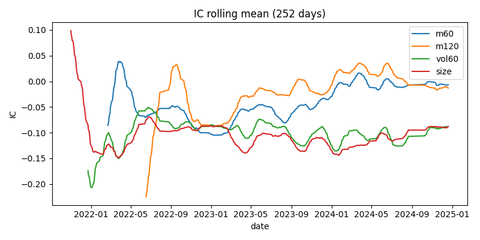
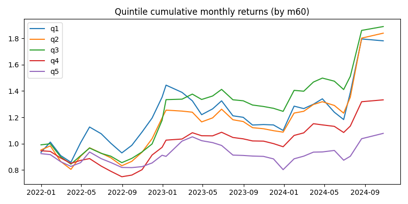

旗舰项目：沪深300 多因子研究（可复现）

快速开始：
1. 克隆仓库并进入项目目录
2. 创建虚拟环境并安装依赖：
   - PowerShell: scripts\setup_env.ps1
   - 或手动： python -m venv .venv && .\.venv\Scripts\python -m pip install -r requirements.txt
3. 下载并清洗数据（示例顺序）：
   python scripts\download_hs300_akshare.py
   python scripts\data_cleaning.py
   python scripts\filter_pool.py
   python scripts\run_filtered_analysis.py

结果文件： outputs/filtered_ic_rolling.png, outputs/filtered_quintile_cum_returns.png

主要结论：
- m120（中期动量）在筛选池上展现稳定正 IC；m60 弱正；vol/size 为负。

产物：notebooks/report.ipynb（可直接展示关键图表）、outputs/one_page_conclusion.md（适合放在简历附件）。

---

项目复现演示（Demo）

目的：一键在本地重现管线，生成清洗数据、因子、IC、回测、鲁棒性与演示材料（PPT/PDF）。

前置环境：
- Windows + PowerShell
- Python 3.10+，建议已创建虚拟环境并在 repo 根目录
- 运行：pip install -r requirements.txt（或手动安装 akshare、scipy、numpy、pandas、matplotlib、scikit-learn、python-pptx、img2pdf）

一键运行（推荐）：
1. 打开 PowerShell，切换到仓库根目录（例如：C:\Users\you\Desktop\quant）
2. 运行：powershell -ExecutionPolicy Bypass -File scripts\run_demo.ps1

说明：
- run_demo.ps1 顺序执行：download_hs300_akshare.py -> data_cleaning.py -> filter_pool.py -> run_filtered_analysis.py -> statistical_significance.py -> visualize_stat_significance.py -> multi_factor_portfolio.py -> run_robustness.py -> generate_presentation.py
- 若网络或 akshare 下载受限，可在运行前手动准备 data/ 下的原始 CSV 或跳过下载（脚本支持跳过下载步骤）。
- 若想使用官方行业映射，请将 CSV 放置为 outputs/industry_map.csv（列：symbol,code,industry），脚本会优先使用该文件进行行业中性化。

结果产物（outputs/）：
- multi_factor_nav.csv, multi_factor_summary.csv
- stat_significance_ic_summary.csv, stat_significance_backtest_summary.csv
- stat_ic_pvalues.png, backtest_sharpe_bootstrap.png
- robustness_param_summary.csv, robustness_heatmap_cost_*.png
- multi_factor_presentation.pptx, multi_factor_presentation.pdf

常见问题：
- 下载失败：网络不稳或 akshare API 变更，建议手动下载或重试。
- 依赖问题：使用 pip install -r requirements.txt，并确保 python-pptx、img2pdf 可用。

联系方式：仓库: https://github.com/Railovo/demo

注：运行脚本会生成并提交 outputs/ 到本地仓库（若希望手动控制提交，请在 run_demo.ps1 中注释最后的 git 提交行）。
